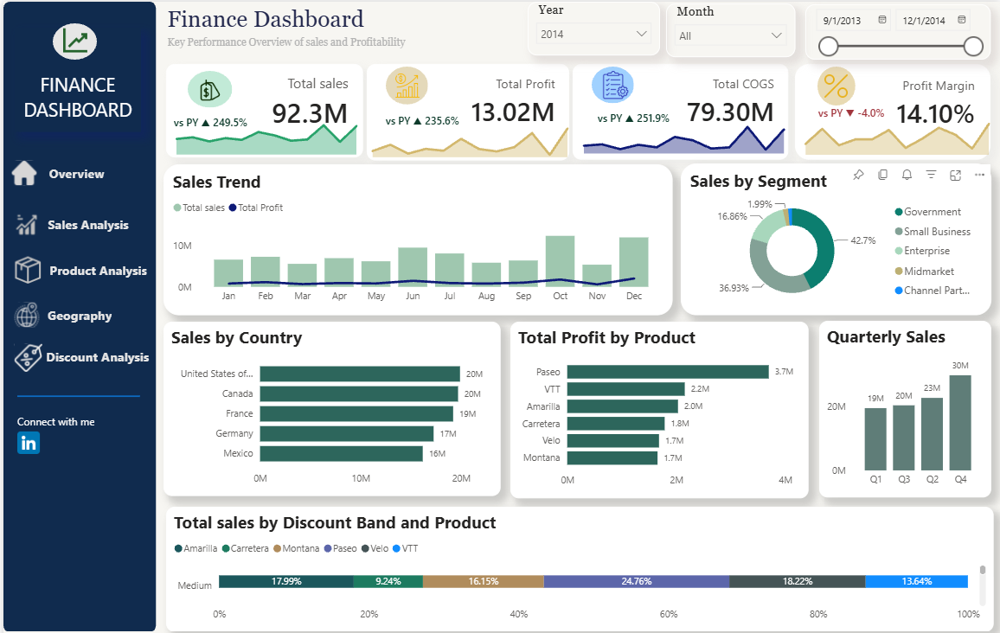

# 📊 Financial Performance Dashboard (Power BI)

## Overview

This interactive Power BI dashboard provides business insights by analyzing sales performance, profitability, cost of goods sold (COGS), customer segments, products, and geographical performance.

---
 
## Dashboard Preview



---

## Business Objectives

- Monitor Total Sales
- Track Total Profit
- Analyze COGS
- Compare Profit Margin
- Identify Top Products
- Analyze Sales by Country
- Understand Sales Segments
- Monitor Monthly Sales Trends

---

## Tools Used

- Power BI
- Power Query
- DAX
- Excel

---

## Dashboard Features

- KPI Cards
- Interactive Filters
- Drill Through
- Bookmarks
- Conditional Formatting
- Navigation Buttons
- Dynamic Visualizations

---

## Repository Structure

```
financial-performance-dashboard-powerbi/
│
├── Dashboard/
│   └── Finance Dashboard.pbix
│
├── Images/
│   └── Dashboard.png
│
└── README.md
```

---

## Author

**Deeksha Poojary**

Aspiring Data Analyst

- LinkedIn: https://www.linkedin.com/in/deeksha-poojary-584423230/
- GitHub: https://github.com/Deekshapoojary
